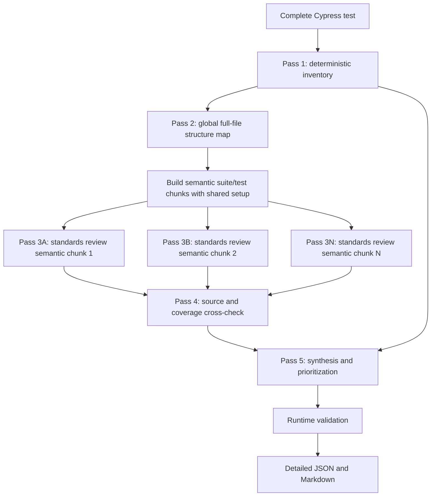

# Cypress AI Quality Reviewer — Comprehensive Audit Mode

## 1. Purpose

Audit mode is the comprehensive, human-oriented counterpart to the default focused CI review. It is designed to produce the kind of analysis expected from a careful senior test engineer:

- An overall assessment of the suite.
- Concrete measurements of recurring patterns.
- Practices that were implemented well.
- Reliability, maintainability, and test-design problems.
- Alignment with the applicable Levelbuild testing standards.
- Comparison with related production behavior.
- Potential coverage gaps.
- Tests that belong at a different test level.
- A prioritized improvement plan.
- Honest limitations based on the context that was available.

Audit mode reviews code; it does not run Cypress, calculate runtime coverage, or change the test/component.

## 2. Why audit mode is multi-pass

The focused reviewer sends one large request and deliberately prefers a small number of high-confidence CI findings. That is useful for merge requests but poorly matched to a 3,000-line suite requiring a systematic study.

Audit mode uses a bounded agentic workflow:



“Agentic” here means the system decomposes the goal, gathers evidence with specialized steps, passes structured results between steps, and synthesizes a final answer. It does not mean the model has unrestricted shell or filesystem access.

This bounded design was chosen because it is:

- More thorough than one prompt.
- Predictable enough for CI and local tooling.
- Easier to test than an open-ended autonomous loop.
- Safer because only collected repository context is sent.
- Observable because every pass has a schema and request count.
- Provider-agnostic above native DeepSeek, OpenAI, and Anthropic transport adapters.

## 3. The five passes

### Pass 1: deterministic inventory

`auditInventory.ts` scans the complete test locally without an API call. The same input always produces the same measurements.

It records counts and evidence lines for:

| Metric | Meaning |
|---|---|
| `line_count` | Physical lines in the test file |
| `suite_count` | Named `describe`/`context` declarations detected |
| `test_count` | Named `it`/`test`/`specify` declarations detected |
| `any_cast_lines` | Lines containing `as any` |
| `forced_interactions` | `{ force: true }` occurrences |
| `before_each_hooks` | `beforeEach(...)` occurrences |
| `after_each_hooks` | `afterEach(...)` occurrences |
| `fixed_waits` | Numeric `cy.wait(...)` calls |
| `skipped_tests` | `.skip` declarations |
| `focused_tests` | `.only` declarations |
| `conditional_blocks` | `if (...)` blocks |
| `silent_conditional_assertion_blocks` | Heuristic candidates where assertions may execute only if an element/value exists |
| `private_member_access_lines` | Lines accessing underscore-prefixed members such as `picker._map` |
| `broad_exception_handlers` | `uncaught:exception` handlers |
| `generic_selector_calls` | Broad `cy.get('input')`, tag, or class-only selector calls |

The counts are evidence and review leads, not automatic violations. For example, `{ force: true }` can be justified at a difficult browser boundary. The AI passes decide whether the actual usage is problematic.

On the current `Address.cy.ts`, the inventory detects the same key patterns highlighted by the earlier manual Codex review, including 101 lines with `as any`, 15 forced interactions, 18 `beforeEach` hooks, 18 `afterEach` hooks, and one fixed wait. These values describe the current working file and will change as the file changes.

### Pass 2: global full-file structure map

Before splitting local evidence, the model reads the complete numbered test with the applicable standards and deterministic inventory. It produces a compact map of suites, shared infrastructure, key behaviors, and cross-suite patterns. Every semantic chunk receives this map, so it knows where its code sits in the complete file.

### Pass 3: standards review by semantic test chunk

The chunker parses the TypeScript syntax tree and keeps complete top-level `describe`/`context` suites together. If the file has one large outer suite, as `Address.cy.ts` does, it descends into its nested suites and groups complete nested suites without exceeding the target size. Imports, helpers, hooks, and outer-suite setup are extracted as shared context and supplied to every child chunk.

Only a single suite that is itself larger than the configured limit falls back to line windows with 30 lines of overlap. Every code line retains its original global line number. If one semantic region later exhausts its transport retries, only that failed region is split again into smaller overlapping recovery chunks; successful siblings are not repeated.

The current `Address.cy.ts` becomes six semantic chunks aligned to areas such as rendering/dialogs, validation/address operations, geocoding/maps, autocomplete/geolocation, map interactions/helpers, and lifecycle/geodata.

Each chunk reviewer must inspect:

- Observable behavior versus private implementation state.
- Assertion strength and whether the test name matches what is proved.
- Reproduction of production logic in test code.
- Cypress synchronization and retryability.
- Conditional branches that can pass without asserting anything.
- Selector stability and forced actions.
- Stubbing and monkey-patching boundaries.
- Setup, cleanup, and isolation.
- Whether the scenario is appropriate for component/E2E testing.
- Practices that align well with the standards.

The chunk response contains strengths and concerns, each with real evidence lines and standards references. Chunk output is intermediate evidence; it is not written directly as the final report.

Chunk reviews are independent and run with bounded concurrency. The default concurrency is two, reducing elapsed time without producing an uncontrolled request burst. Adaptive recovery chunks run sequentially with thinking disabled and a 10,000-token first allowance so recovery reduces both connection duration and provider load.

### Pass 4: source and coverage cross-check

This pass receives:

- The named test inventory.
- Deterministic metrics.
- Strengths and concerns extracted from every test chunk.
- Applicable standards.
- Collected component, story, fixture, support, service, and related source context.

It compares production behavior with test evidence and returns:

- Clearly covered behavior.
- Potentially missing or weak coverage.
- Source and test evidence for every proposed gap.
- Pure helper/implementation-detail tests that may belong at unit level.
- Context limitations.

Coverage gaps are deliberately limited to `low` or `info`. Static source comparison cannot prove runtime coverage, so uncertain cases remain explicitly potential.

Audit mode increases related-context defaults to:

```text
maximum related files:       8
additional context budget:   180,000 characters
maximum per related file:    100,000 characters
```

The complete Cypress test remains outside this additional-context budget. Related context is still bounded and repository-local.

### Pass 5: evidence synthesis and prioritization

The lead-reviewer pass receives the outputs of all previous passes rather than rereading one enormous undifferentiated prompt. It must:

1. Describe the suite’s overall functional ambition and confidence level.
2. Consolidate repeated chunk concerns into suite-wide findings.
3. Preserve representative and related line locations.
4. Keep strengths separate from violations.
5. Keep coverage gaps separate from proven quality problems.
6. Assess materially relevant standards areas.
7. Identify test-level placement issues.
8. Rank the recommended improvements by engineering value.
9. State limitations.

It also receives raw test excerpts around every strength, concern, and deterministic finding so it can verify important evidence rather than relying only on summaries.

The first synthesis attempt uses thinking at high effort. If it is malformed or truncated, the full retry disables thinking so the output allowance is used for JSON rather than hidden reasoning. If either attempt is parseable JSON with a narrow schema problem, a targeted non-thinking repair receives only the invalid object and exact error; the tool does not resend the full synthesis context first. Redundant empty `message`, `impact`, or `suggestion` prose is recovered locally from the other validated finding fields.

The prompt explicitly says deterministic findings are seeds, not the scope. This prevents a numeric `cy.wait()` finding from anchoring the entire audit.

## 4. Runtime validation and failure behavior

Every AI pass uses the selected provider's JSON facility and is then validated locally. DeepSeek and OpenAI use JSON Object mode; Claude also receives the exact schema through native structured output. Provider output alone is never trusted: the tool checks required fields, enum values, non-empty text, line types, arrays, and evidence locations.

Additional audit checks ensure:

- Chunk evidence points inside that chunk’s global line range.
- Final finding, strength, and placement lines exist in the test.
- Coverage findings use only `low` or `info` severity.
- The returned chunk ID matches the requested chunk.

Malformed or truncated output is retried once for that pass. Parseable schema-invalid synthesis and global-map output uses a smaller targeted repair instead of repeating the full prompt. DeepSeek uses SSE streaming. Recoverable fetch/socket/connect, DNS, rate-limit, and server failures receive bounded error-specific retry timing; permanent 4xx responses are not retried. If the AI global map remains unavailable, the reviewer continues with a deterministic suite/test map and records that limitation. If a standards chunk still fails, only that chunk is adaptively split and retried without thinking. If a later required pass still cannot complete, the file receives `status: "error"`, but deterministic findings and completed AI evidence remain in the report.

Cardinality limits are presentation bounds rather than correctness conditions. When final synthesis returns more than 30 structurally valid findings, local normalization validates all items and global line references, consolidates exact rule/title duplicates, merges their related evidence, and selects the highest-priority 30 by severity, confidence, evidence, and recurrence. Priorities are stripped of references to omitted rule IDs, and an audit limitation records the returned and retained counts. More than 120 raw finding items remains a schema/safety failure and uses the normal repair path.

Truncation uses an adaptive allowance. Format retries use thinking disabled so their output budget is spent on complete JSON rather than repeating the first pass's reasoning:

| Pass | First attempt | Truncation retry | Reasoning effort |
|---|---:|---:|---|
| Standards chunk | 20,000 | 40,000 | high |
| Source/coverage | 20,000 | 40,000 | high |
| Final synthesis | 30,000 | 60,000 | high |

These are generated-output limits, not account credit limits or input-context limits. Truncated or malformed responses receive the larger retry allowance. For a parseable schema failure, progress includes the exact validator message and a targeted repair prompt tells the model what must be corrected.

Each chunk receives global metric counts but only the metric locations, named tests/suites, and deterministic findings whose lines fall inside that chunk. Earlier versions supplied global locations to every chunk, which could encourage a valid model to return an out-of-range line that the chunk validator then rejected.

Findings remain advisory. A completed audit with high findings exits `0`; an incomplete audit or tool/API/schema failure exits `1`. Partial chunk concerns are labelled informational because final synthesis did not assign their normal severity.

## 5. Rich audit output

The existing per-file fields remain available:

```text
file
test_type
status
summary
findings
context_files_used
```

Audit mode adds an `audit` object:

```text
audit.overall_assessment
audit.metrics
audit.metric_locations
audit.strengths
audit.standards_assessment
audit.coverage_gaps
audit.test_placement_issues
audit.priorities
audit.limitations
audit.context_actually_used
audit.execution
```

`audit.execution.global_map_source` is `ai`, `checkpoint`, `deterministic_fallback`, or `not_available`. A deterministic fallback does not hide the degradation: it is repeated in `audit.limitations` and `audit.execution.adaptive_recoveries`, while successful standards chunks and synthesis can still produce a completed audit.

Audit findings also add optional rich evidence fields to the compatible finding contract:

```text
end_line
impact
evidence
standards_references
related_locations
```

The Markdown report renders these as the following study sections:

1. Overall assessment
2. Deterministic inventory
3. What was done well
4. Findings
5. Standards assessment
6. Coverage gaps
7. Test-level placement
8. Recommended priority
9. Audit limitations
10. Audit execution mechanics

## 6. How to run an audit

From the reviewer package:

```bash
cd WebAppTests/QualityReviewer
npm ci
export DEEPSEEK_API_KEY="your-key"

npm run qa-review -- \
  --mode audit \
  --files WebAppComponents/ClientApp/src/components/inputs/address/Address.cy.ts \
  --format both \
  --output address-audit.json
```

To use another provider, set `OPENAI_API_KEY` and add `--provider openai`, or set `ANTHROPIC_API_KEY` and add `--provider anthropic`. The multi-pass audit, standards context, schemas, checkpoints, and report remain the same. See [PROVIDER_GUIDE.md](./PROVIDER_GUIDE.md).

This writes:

```text
address-audit.json
address-audit.md
```

Audit changed files relative to a branch with:

```bash
npm run qa-review -- \
  --mode audit \
  --base origin/main \
  --format both \
  --output qa-audit.json
```

Tune chunking when needed:

```bash
npm run qa-review -- \
  --mode audit \
  --files path/to/Large.cy.ts \
  --audit-chunk-lines 500 \
  --audit-concurrency 1
```

Smaller chunks usually improve local attention but create more requests. Larger chunks reduce requests but may miss distributed patterns.

## 7. Request count and cost model

Without retries, an audit uses approximately:

```text
1 global map + number of semantic test chunks + 1 coverage pass + 1 synthesis pass
```

For the current 3,161-line `Address.cy.ts`, the semantic chunker creates six chunks, so a clean uncached audit expects nine logical requests. A model-output retry or targeted repair adds one request for the affected pass. A transient connection failure can add up to the configured transport attempts; adaptive recovery replaces only the failed chunk with smaller evidence requests.

Global-map, semantic-chunk, and coverage results are stored in a content-addressed checkpoint under `.qa-review-cache/`. The key includes the test, standards, related context, model, provider, endpoint, chunk configuration, and explicit audit-pipeline revision. If synthesis fails, rerunning the same command reuses those passes and normally makes only the synthesis request. Source, standards, provider configuration, or pipeline-revision changes automatically produce a new key. A pipeline upgrade intentionally creates a one-time cache miss rather than reusing evidence produced by an incompatible prompt or schema. Use `--no-audit-cache` to bypass checkpoints.

The JSON report records the actual HTTP request count under:

```json
{
  "audit": {
    "execution": {
      "complete": true,
      "test_chunks_reviewed": 6,
      "test_chunks_total": 6,
      "source_context_files_reviewed": 5,
      "ai_calls": 9,
      "provider": "deepseek",
      "requested_model": "deepseek-v4-flash",
      "response_models": ["deepseek-v4-flash"],
      "requests": [
        {
          "operation": "audit standards chunk semantic-11-605",
          "attempt": 1,
          "transport_attempt": 1,
          "requested_model": "deepseek-v4-flash",
          "response_model": "deepseek-v4-flash",
          "max_tokens": 20000,
          "finish_reason": "stop",
          "duration_ms": 18432,
          "status": "completed",
          "usage": {
            "prompt_tokens": 23140,
            "completion_tokens": 4521,
            "reasoning_tokens": 2910,
            "total_tokens": 27661,
            "prompt_cache_hit_tokens": 0,
            "prompt_cache_miss_tokens": 23140
          }
        }
      ],
      "passes": [
        "deterministic inventory",
        "global full-file structure map",
        "standards review by test chunk",
        "source and coverage cross-check",
        "evidence synthesis and prioritization"
      ],
      "checkpoint_key": "content-addressed SHA-256 key",
      "reused_passes": [],
      "adaptive_recoveries": []
    }
  }
}
```

The numbers in this example are illustrative. A provider may omit individual usage fields, in which case the report stores `null`.

## 7.1 Live progress output

The command prints useful lifecycle updates instead of remaining silent during long model calls:

```text
[qa-review] Starting audit review for 1 file(s); requested model: deepseek-v4-flash.
[qa-review] Preparing WebAppComponents/.../Address.cy.ts (component).
[qa-review] Collected 5 related context file(s) for WebAppComponents/.../Address.cy.ts.
[qa-review] Inventory complete for WebAppComponents/.../Address.cy.ts: 3161 lines, 79 tests, 19 suites, 6 semantic audit chunks.
[qa-review] Starting audit global full-file map (attempt 1, model deepseek-v4-flash, max output 20000).
[qa-review] Starting audit standards chunk semantic-11-605 (attempt 1, model deepseek-v4-flash, max output 20000).
```

When output is truncated:

```text
[qa-review] Retrying audit final synthesis after truncated output; max output tokens 30000 → 60000.
```

When the API reports a different model from the requested model, the completion message prints both. `--quiet` suppresses these updates.

The reviewer emits a heartbeat every 30 seconds. DeepSeek responses use SSE so reasoning/content deltas and keep-alive comments continuously cross the connection; OpenAI and Anthropic retain their native response mechanics. The heartbeat distinguishes total elapsed time, waiting for headers, bytes received, and seconds since the last stream data. Defaults are 30 seconds for response headers, 90 seconds of stream inactivity, and a 15-minute audit safety ceiling. Active stream data resets the inactivity timeout but not the total ceiling.

If one concurrent chunk fails after transport and adaptive recovery, the orchestrator stops scheduling new top-level chunks and waits for already-active requests to settle before writing the partial report. Provider logs therefore cannot appear after `Report saved`.

If an audit remains incomplete, its normal `audit` object is retained with `execution.complete: false`, reviewed/total chunk counts, adaptive recovery names, request traces, deterministic metrics, completed strengths, informational partial concerns, and limitations. The top-level error and exit code still make the incomplete result unambiguous.

Provider APIs are treated as stateless, so each pass includes the context it requires. Shared prompt prefixes may benefit from provider-side context caching, but the reviewer does not assume a cache hit.

## 8. Illustrative input and output

Input:

```typescript
describe('profile editor', () => {
  it('saves profile changes', () => {
    cy.mountStory(profileStories.default)
    cy.get('input').then($input => {
      if ($input.length > 0) {
        cy.wrap($input).type('Ada')
      }
    })
    cy.wait(500)
  })
})
```

An abbreviated audit could report:

```json
{
  "mode": "audit",
  "files": [{
    "file": "Profile.cy.ts",
    "status": "fail",
    "summary": "The suite uses a realistic story but does not prove that saving occurred.",
    "findings": [{
      "line": 3,
      "end_line": 8,
      "severity": "high",
      "rule": "AUDIT-ASSERTION-001",
      "category": "quality",
      "title": "Save test performs actions without proving the saved result",
      "message": "The test types conditionally and then waits, but never asserts an event, request, or rendered saved state.",
      "impact": "The test can pass when the input is missing or persistence is broken.",
      "suggestion": "Require the input to exist, perform the edit, trigger save, and assert the public result supported by the component contract.",
      "replacement_code": null,
      "specific_cypress_methods": ["cy.get", "cy.wait"],
      "context_used": ["Profile.cy.ts", "component standards"],
      "confidence": "high",
      "evidence": ["The conditional body is the only interaction.", "There is no post-action assertion."],
      "standards_references": ["Observable outcomes", "Synchronization"],
      "related_locations": [4, 9]
    }],
    "audit": {
      "strengths": [{
        "title": "Realistic story mount",
        "description": "The test mounts the normal component story.",
        "evidence_lines": [3],
        "standards_references": ["Realistic rendered context"],
        "why_it_matters": "Story configuration exercises production-like inputs.",
        "confidence": "high"
      }],
      "coverage_gaps": [],
      "priorities": [{
        "rank": 1,
        "action": "Add an observable save assertion and remove the silent conditional.",
        "rationale": "The existing test can pass without testing its named behavior.",
        "related_finding_rules": ["AUDIT-ASSERTION-001"]
      }]
    }
  }]
}
```

The example is abbreviated: real output includes metrics, metric locations, standards assessment, placement issues, limitations, execution metadata, and all normal report fields.

## 9. What audit mode can do

- Review very large Cypress files systematically rather than relying on one attention pass.
- Recognize and explain positive testing practices.
- Detect recurring suite-wide patterns with exact local counts.
- Compare tests with the supplied component/source context.
- Distinguish quality problems, potential coverage gaps, and test-level placement.
- Consolidate duplicate observations into a prioritized report.
- Generate compatible JSON plus a detailed Markdown study document.
- Preserve the existing fast focused mode and CI behavior.
- Automatic cross-provider fallback or multi-model comparison in one run.

## 10. What audit mode cannot do

- It does not execute Cypress or prove that tests pass.
- It does not collect Istanbul/runtime coverage.
- It cannot prove behavior from source files that were not collected or were truncated.
- Its conditional/private-selector metrics are intentionally heuristic; they are leads, not verdicts.
- It cannot guarantee the exact same wording or judgment as Codex or a human reviewer.
- It does not autonomously search arbitrary repository files after the review begins.
- It does not modify tests, components, Git state, merge requests, or external systems.
- It does not remove the need for developer judgment, especially around browser/map boundaries.

## 11. File-by-file implementation map

| File | Audit responsibility |
|---|---|
| `src/cli.ts` | Parses `--mode audit`, applies audit context defaults, chooses the audit provider, and attaches rich output |
| `src/auditInventory.ts` | Builds metrics, creates semantic suite/test chunks with shared setup, and subdivides a transport-failed region while preserving global lines |
| `src/auditCheckpoint.ts` | Creates content-addressed checkpoint keys and atomically saves reusable global, chunk, and coverage results |
| `src/auditPromptBuilder.ts` | Defines the specialized instructions and structured inputs for chunk, coverage, and synthesis passes |
| `src/auditSchema.ts` | Defines all three intermediate/final JSON schemas and validates model output at runtime |
| `src/deepSeekClient.ts` | Provides authenticated JSON requests, adaptive truncation retries, requested/returned model telemetry, token usage, timings, progress, and request traces |
| `src/deepSeekConfig.ts` | Validates the key, model, and endpoint before any audit request |
| `src/deepSeekAuditReviewer.ts` | Orchestrates the pass graph, bounded concurrency, adaptive failed-chunk recovery, partial evidence preservation, line validation, synthesis, and execution metadata |
| `src/deepSeekReviewer.ts` | Retains the original single-pass focused reviewer using the shared DeepSeek client |
| `src/types.ts` | Defines review mode, rich audit report structures, metrics, strengths, gaps, placement, priorities, and enhanced finding evidence |
| `src/reportWriter.ts` | Writes the detailed audit Markdown sections while retaining focused output |
| `src/contextCollector.ts` | Selects repository-local related context; audit mode gives it larger limits |
| `src/git.ts` | Strictly validates explicit tests and discovers committed, staged, unstaged, and untracked Cypress changes with resolved-path safety |
| `test/auditInventory.test.ts` | Verifies deterministic measurements and chunk boundaries |
| `test/deepSeekAuditReviewer.test.ts` | Verifies the complete three-request one-chunk workflow with a mocked DeepSeek endpoint |
| `test/cli.test.ts` | Verifies audit arguments, defaults, and invalid option combinations |
| `test/cliIntegration.test.ts` | Verifies structured configuration errors, strict explicit paths, focused diagnostics, and report preflight through the compiled CLI |

## 12. Why this is not yet a free-running tool agent

DeepSeek supports multi-turn conversations and function/tool calls, so a later version could expose read-only tools such as:

```text
search_test(pattern)
read_test_lines(start, end)
read_related_file(path, start, end)
search_related_context(pattern)
```

That would let the model request follow-up evidence dynamically. It also introduces extra concerns: tool-call validation, repository path authorization, loop termination, repeated reasoning context, cost ceilings, and reproducibility.

The implemented pipeline captures most of the value through deterministic local tools and specialized passes without those risks. Tool calling should be added only if real audit results show that bounded context collection still misses important evidence.
