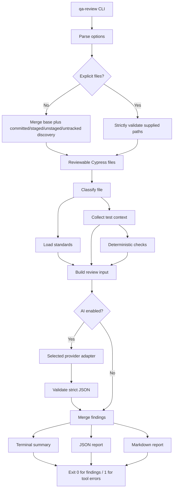

# Cypress AI Quality Reviewer — Architecture and Study Guide

This guide explains the Cypress AI Quality Reviewer that was implemented for the Levelbuild WebApp. It is intended to be read alongside the TypeScript source so that the design, execution path, data contracts, and extension points are clear.

The original focused review described throughout this document remains the default. The later comprehensive `audit` workflow is documented in [AUDIT_MODE_GUIDE.md](./AUDIT_MODE_GUIDE.md); that guide takes precedence wherever audit-mode behavior differs from the focused MVP.

The reviewer is a small CI-friendly command-line application. It reviews the quality of Cypress test code; it does not run Cypress tests or modify source/test files. It writes the requested JSON and/or Markdown reports.

## 1. What problem the reviewer solves

The WebApp already has Cypress component and E2E tests, plus internal standards documents describing how those tests should be written. The reviewer turns those standards into a repeatable review step:

```text
changed Cypress test
        ↓
classify as component / e2e / unknown
        ↓
load the appropriate standards
        ↓
run small deterministic checks
        ↓
collect bounded feature context
        ↓
ask an AI reviewer for evidence-based findings
        ↓
validate and merge findings
        ↓
print terminal output and write reports
```

The intended command is:

```bash
qa-review --base origin/main --output qa-review-results.json
```

The default policy is advisory. A test can receive critical or high findings and the reviewer still exits with code `0`. The reviewer exits with code `1` when the review tool itself cannot operate correctly, such as when Git, standards loading, the API, schema validation, or report writing fails.

## 2. Where the implementation lives

The implementation is isolated under:

```text
WebAppTests/QualityReviewer/
```

This keeps it close to the E2E tests while allowing it to inspect both test projects.

The package prefers the standards in the WebApp checkout and carries exact fallback copies in its own `standards/` directory:

```text
WebAppComponents/ClientApp/src/components/COMPONENT_TESTING_STANDARDS.md
WebAppTests/EndToEnd/TESTING_STANDARDS.md
```

The project layouts used by classification and context discovery are:

```text
WebAppComponents/ClientApp/src/**/*.cy.ts                  component tests
WebAppTests/EndToEnd/cypress/e2e/**/*.cy.ts                E2E tests
WebAppComponents/ClientApp/cypress/**                      component support/fixtures
WebAppTests/EndToEnd/cypress/**                             E2E support/fixtures
```

The implementation also accepts JavaScript and `.spec.*` variants where the file-selection rules permit them.

## 3. High-level architecture

The application is deliberately layered. Each layer has one main responsibility:

| Layer | Responsibility |
|---|---|
| CLI orchestration | Parse options, choose files, run the review pipeline, choose the exit code |
| Git adapter | Find the repository, compute changed files, read file-specific diffs, list tracked files |
| Classifier | Decide whether a file is a component, E2E, or unknown test |
| Standards loader | Prefer project standards, fall back to bundled component/E2E standards, and reject empty documents |
| Context collector | Build a small, bounded context bundle around one test |
| Deterministic checks | Detect `.only`, numeric waits, and `.skip` without an API call |
| Prompt builder | Turn standards, test, diff, context, and deterministic findings into model input |
| Provider configuration | Select DeepSeek, OpenAI, or Anthropic and validate its key/model/endpoint |
| Provider adapters | Translate the shared request into each vendor's native HTTP protocol |
| JSON AI client | Apply shared timeout, retry, validation, repair, telemetry, and progress behavior |
| Response validator | Enforce the finding schema and allowed enum values |
| Report writer | Merge findings, count severities, print terminal output, and write JSON/Markdown |
| GitLab job | Run the CLI for qualifying merge requests and upload report artifacts |

The main data flow is:



## 4. The execution lifecycle

For each invocation, `src/cli.ts` performs the following sequence.

### Step 1: Parse command-line arguments

The parser accepts:

```text
--base <ref>
--files <paths...>
--output <path>
--format json|markdown|both
--deterministic-only
--max-related-files <count>
--max-context-chars <count>
--max-file-chars <count>
--quiet
--help
```

The default values are:

```text
base: origin/main
output: qa-review-results.json
format: json
max related files: 5
additional diff/context budget: 50,000 characters
maximum single related file: 12,000 characters
```

There is one useful distinction between automatic and manual review:

- If `--base` is omitted and `--files` is supplied, the base becomes `null`. This makes explicit-file review work without requiring a branch ref or a Git diff.
- If `--base` is supplied with `--files`, the diff is included for those files.
- If no `--files` are supplied, the default base is `origin/main`.

The parser is intentionally small and dependency-free. It does not use Commander, yargs, or another argument framework.

### Step 2: Find the repository and select files

`findRepositoryRoot()` runs:

```bash
git -C <starting-directory> rev-parse --show-toplevel
```

Automatic selection combines:

```bash
git diff --name-only --diff-filter=ACMR <base>...HEAD --
git diff --name-only --diff-filter=ACMR --
git diff --cached --name-only --diff-filter=ACMR --
git ls-files --others --exclude-standard
```

The `--diff-filter=ACMR` option means added, copied, modified, or renamed files are considered. Deleted files are excluded because there is no file content to review. Combining all four sources ensures committed branch changes, staged changes, unstaged edits, and untracked Cypress tests are discoverable. A file-specific base diff is calculated from the merge base to the current working tree, matching the content that is actually reviewed.

Both sources use the same safety checks, but explicit paths use strict validation while Git-discovered deleted/non-test paths may be ignored. The filter:

1. Normalizes and de-duplicates paths.
2. Requires every explicit path to be a recognized Cypress test.
3. Confirms the path exists and is a regular file.
4. Resolves symlinks and rejects real targets outside the repository.
5. Reports every invalid explicit path instead of silently dropping it.
6. Sorts the result for stable output.

The current reviewable patterns are:

```text
*.cy.ts, *.cy.js, *.cy.mts, ...
*.spec.ts, *.spec.js, *.spec.mts, ...
cypress/e2e/**/*.ts|js|...
```

The special `cypress/e2e` rule allows E2E scripts even when their filename does not use `.cy` or `.spec`.

If Git discovery finds no tests, the command prints:

```text
No changed Cypress test files found.
```

It still writes an empty report and exits successfully.

An explicit `--files` request is different: a missing file, directory, unsupported extension, or repository escape is a command error. This prevents a typo from masquerading as a successful zero-file review.

### Step 3: Classify each file

`classifyTestFile()` uses normalized path signals rather than inspecting test code.

| Path signal | Type |
|---|---|
| `WebAppTests/EndToEnd/cypress/e2e/` | `e2e` |
| Any `/cypress/e2e/` or `/e2e/` path | `e2e` |
| `WebAppComponents/ClientApp/src/` | `component` |
| `/cypress/component/`, `/components/`, or `/component/` | `component` |
| Anything else | `unknown` |

Classification is intentionally conservative outside the known WebApp layouts. An unknown test is not discarded; it receives both standards documents. `--test-type component` or `--test-type e2e` overrides classification for unusual locations.

### Step 4: Load standards

`defaultStandardsPaths()` resolves standards relative to the Git repository root, not relative to the current shell directory. This allows the command to be run from the package folder or another directory inside the repository.

The standards loader:

- Reads only the document needed for `component` or `e2e`.
- Reads and concatenates both documents for `unknown`.
- Prefers the matching document in the WebApp checkout.
- Falls back to the matching copy bundled in the standalone package when the project document is absent.
- Rejects an empty document.

The standards content is passed to the model as source-of-truth input. The reviewer does not hard-code the full standards in its prompt.

### Step 5: Collect context

The context collector receives one test file and returns this shape:

```typescript
{
  test_file: {
    path: string
    content: string
  }
  diff: string
  related_files: Array<{
    path: string
    reason: string
    content: string
    truncated: boolean
  }>
}
```

The complete test file is always included. This is important because deterministic checks and AI findings must use real line numbers from the complete file.

The configurable context budget applies to additional diff and related-file content. The diff can consume at most half of that budget, which preserves room for implementation context even when a changed test is very large.

#### 5.1 Imported files

The collector scans static imports, exports-from statements, `require(...)`, and dynamic `import(...)` calls. It resolves:

- Relative imports such as `./Address` and `../../support/e2e.ts`.
- Levelbuild component alias imports such as `@/components/dialog/Dialog`.
- Component Cypress alias imports such as `@test-home/support/advanced-functions.ts`.

The aliases are resolved specifically for this repository:

```text
@/          → WebAppComponents/ClientApp/src/
@test-home/ → WebAppComponents/ClientApp/cypress/
```

Package imports such as `lit` or `cypress` are ignored because they do not resolve to repository files.

Supported extension resolution tries TypeScript, JavaScript, and JSON variants, plus `index.*` files for directory imports.

#### 5.2 Fixtures

The collector detects calls such as:

```typescript
cy.fixture('users')
```

It searches the Cypress fixture directory associated with the test and resolves common extensions, including `users.json`.

#### 5.3 Cypress support files

For a test under a known Cypress root, the collector considers:

```text
cypress/support/commands.ts
cypress/support/e2e.ts
cypress/support/component.ts
```

Files that do not exist are silently skipped because context is best effort. Component tests under `WebAppComponents/ClientApp/src` use the project’s `WebAppComponents/ClientApp/cypress` root even though their test path itself is not inside a Cypress directory.

#### 5.4 Name-matched source files

The collector calls `git ls-files` and searches only selected source prefixes:

```text
WebAppComponents/ClientApp/src/
WebApp/ClientApp/src/
WebApp/src/
```

It derives terms from the test filename. For example:

```text
ZipViewer.cy.ts → zip, viewer
Address.cy.ts   → address
```

Generic terms such as `test`, `spec`, `component`, and `page` are removed. Source filenames matching the remaining terms are ranked by the number of matching terms and then path length. Existing test files are excluded from this source-match phase.

#### 5.5 Limits and truncation

The collector stops when it reaches either:

- `maxRelatedFiles`, default `5`.
- The remaining additional context budget.

Related files larger than `maxSingleFileCharacters`, default `12,000`, are condensed. The condensed representation favors:

- Imports
- Exports
- Lines containing test-name terms
- Two nearby lines on either side of matching lines

If that produces too little content, a head/tail fallback is used. The `truncated` flag tells the prompt and report that the content is partial.

This is intentionally bounded context collection, not a codebase indexer. It does not perform AST analysis, semantic search, dependency graph traversal, or whole-folder uploads.

### Step 6: Run deterministic checks

Deterministic checks run before the AI call. They are fast, predictable, and available through `--deterministic-only`.

The implementation has exactly three initial rules.

#### `CYPRESS-FOCUS-001` — focused tests

Pattern:

```typescript
describe.only(...)
it.only(...)
context.only(...)
```

Severity: `critical`

Reason: `.only` prevents the rest of the selected suite from running.

Example finding:

```json
{
  "line": 4,
  "severity": "critical",
  "rule": "CYPRESS-FOCUS-001",
  "title": "Focused it committed with .only",
  "message": "A focused test prevents the rest of the selected suite from running.",
  "suggestion": "Remove .only from it before committing this file."
}
```

#### `CYPRESS-ASYNC-001` — fixed-duration waits

Pattern:

```typescript
cy.wait(1000)
cy.wait(3_000)
```

Severity: `high`

Reason: elapsed time is not an application condition. It can make tests slow and flaky.

The deterministic finding does not invent a route or endpoint. Its replacement code is `null`, and the suggestion tells the AI review to use the actual request alias, rendered state, component event, or `updateComplete` proven by context.

#### `CYPRESS-SKIP-001` — skipped tests

Pattern:

```typescript
describe.skip(...)
it.skip(...)
context.skip(...)
```

Severity: `medium`

Reason: skipped tests silently remove intended coverage.

#### Matching behavior

Checks are line-based regular expressions, not an AST parser. Leading `//` and `*` comment lines are skipped. Inline comments and more complex multiline expressions are not fully parsed. This keeps the MVP small but means the deterministic layer should be treated as a focused safety net, not a complete JavaScript parser.

Each deterministic finding already conforms to the shared `Finding` shape and has `source: "deterministic"`.

#### Why the MVP has only these three deterministic rules

A deterministic rule is a hard-coded check whose result is decided entirely by the input code. It does not call DeepSeek and does not make a probabilistic judgment. Given the same file, it always returns the same findings.

The original implementation plan explicitly selected `.only`, numeric `cy.wait(...)`, and `.skip` as the MVP rule set. They are good first deterministic rules because they are:

- High signal: each pattern usually represents a real test-suite risk.
- Easy to explain: developers can understand exactly why a finding appeared.
- Cheap to execute: one line scan is enough.
- Provider-independent: they work without a network connection or API key.
- Low-context: they do not require deep knowledge of the application feature.
- Directly actionable: remove `.only`, restore/remove `.skip`, or synchronize a numeric wait with an observable condition.

Many other standards are contextual rather than purely syntactic. For example, `.eq(0)` may be wrong when it accidentally depends on order, but valid when order is the behavior under test. `{ force: true }` may hide an actionability problem, but can also be intentional for a known shadow-DOM boundary. A `beforeEach()` hook may be too expensive if it creates infrastructure, but perfectly valid if it only navigates and aliases UI elements. Turning those patterns into unconditional regular-expression findings would create noisy false positives.

The AI layer handles those nuanced standards today because it sees the standards, full test, diff, and related source context. Additional deterministic rules can be added later when their conditions and exceptions are precise enough to test reliably.

### Step 7: Build the AI prompt

`promptBuilder.ts` creates two pieces:

1. A stable instruction block describing reviewer behavior.
2. A structured input block containing the current file and context.

The instructions require the model to:

- Review only supplied code, standards, and context.
- Avoid vague style opinions.
- Prefer fewer high-quality findings.
- Use actual selectors, routes, endpoints, aliases, fixtures, and custom commands only when present.
- Set `replacement_code` to `null` rather than invent missing details.
- Attempt concrete `cy.intercept(...)`, `cy.wait('@alias')`, and final assertions for numeric waits when context proves them.
- Label uncertain coverage feedback as `potential_coverage_gap`.
- Use low or info severity for coverage feedback.
- Return JSON only.

The input is delimited into sections:

```text
<standards>...</standards>
<test_file>...</test_file>
<git_diff>...</git_diff>
<related_context>...</related_context>
<deterministic_findings>...</deterministic_findings>
```

The deterministic findings are supplied to prevent duplicate AI findings and to let the model enrich a deterministic issue with a concrete, context-supported replacement.

On the second attempt, the prompt adds an explicit instruction that the previous response was invalid and that Markdown fences are forbidden.

### Step 8: Call the selected AI provider

The CLI resolves `--provider` (or `QA_AI_PROVIDER`) and creates one of three native adapters: DeepSeek Chat Completions, OpenAI Chat Completions, or Anthropic Messages. `AiJsonClient` then applies timeout, progress heartbeat, bounded transport recovery, truncation retry, targeted repair, telemetry, and local validation. No vendor SDK is required.

DeepSeek remains the compatibility default and uses SSE streaming. Reasoning deltas keep the HTTP connection active but are not included in the JSON payload being validated; content deltas are assembled until `[DONE]`, and the final usage event supplies telemetry. OpenAI uses Bearer authentication, a `developer` instruction message, `max_completion_tokens`, and JSON Object mode. Anthropic uses `x-api-key`, `anthropic-version`, a top-level `system` prompt, `max_tokens`, and `output_config`; it receives the exact native JSON Schema. Provider-specific environment variables and defaults are documented in [PROVIDER_GUIDE.md](./PROVIDER_GUIDE.md).

AI mode sends the applicable standards, complete test, diff, deterministic findings, required schema, and selected related-file content to the configured endpoint. Deterministic-only mode does not create an AI API request. Authentication values are used only in headers and are never printed or stored in reports.

Focused calls have a 120-second total ceiling and retry with 12,000 output tokens after the initial 6,000-token allowance. Audit calls use their larger budgets and a 15-minute total safety ceiling. Both use a 30-second response-header timeout; DeepSeek streams additionally use a 90-second inactivity timeout that resets whenever bytes arrive. Connection resets use exponential retry, DNS errors use longer 5/15/30-second recovery intervals, HTTP 429 honors `Retry-After`, and temporary 5xx responses are retried. Flags can tune every timeout and the bounded retry policy. Progress and reports distinguish provider, requested model, model returned by the API, stream activity, and normalized usage.

The exact JSON schema remains embedded in the prompt and is always enforced by the local TypeScript validator. Native structured output is an additional guard for Claude, not a replacement for local validation.

### Step 9: Validate the model response

For DeepSeek streaming, the response extractor parses SSE events, concatenates `choices[0].delta.content`, records the final finish reason and usage, and ignores private reasoning text. Providers returning a regular response are normalized from their native complete-message shape. A completion with `finish_reason: "length"` is treated as truncated output and receives the same single retry as malformed JSON.

### Adaptive transport recovery

Transport recovery is deliberately local to the failing semantic region:

1. The original chunk uses high thinking and the normal 20,000-token allowance.
2. Each HTTP request receives the configured number of exponential-backoff transport retries.
3. If transport still fails and the region is larger than 100 lines, only that region is divided into smaller overlapping chunks with the same global line numbers and shared setup.
4. Recovery chunks run sequentially with thinking disabled and a 10,000-token first allowance.
5. Each successful recovery chunk is checkpointed immediately. Their bounded strengths and concerns are combined back into the original logical chunk before coverage and synthesis continue.
6. If a small recovery chunk still cannot complete, the reviewer stops cleanly and emits an incomplete audit containing deterministic findings, completed strengths/concerns, metrics, diagnostics, and an explicit limitation.

The checkpoint stores the subdivision manifest, so a rerun can resume adaptive children instead of forgetting which region was decomposed.

The global map has its own recovery path because it runs before semantic chunks exist. Parseable schema-invalid output is repaired from the returned object alone. If the map remains unavailable for a non-permanent failure, the TypeScript inventory provides suite names, test names, hook locations, and conservative line ranges so evidence chunks can still run. Reports expose this as `execution.global_map_source: "deterministic_fallback"`; an AI map recovered on a later run invalidates chunk and coverage checkpoints that depended on the fallback orientation.

The JSON is then validated manually against the same conceptual schema sent to the API. Validation checks:

- Object shape
- `file`, `test_type`, `status`, and `summary`
- Finding line numbers are positive integers
- Severity is one of `critical`, `high`, `medium`, `low`, `info`
- Category is `quality` or `potential_coverage_gap`
- Confidence is `high`, `medium`, or `low`
- Required text fields are non-empty
- `replacement_code` is a string or `null`
- Context arrays contain only strings

The validator adds `source: "ai"` after validation. The model is not asked to produce that internal provenance field.

#### Retry behavior

Malformed or truncated model output is retried once with the configured larger output allowance and an exact explanation. Parseable global-map or synthesis JSON with a narrow schema defect goes directly to a targeted non-thinking repair request, avoiding another full-context call. Recoverable fetch/socket/connect and DNS failures receive error-specific bounded retries. HTTP 429 and temporary 5xx responses are retried, while permanent 4xx responses such as a missing key or invalid parameters are not.

The model-facing synthesis schema still requests at most 30 findings, but local validation treats that number as a report-usability bound. It validates up to a hard safety maximum of 120 returned findings—including every source line—before selection. Exact rule/title duplicates are merged with their related locations and evidence. Remaining items are ranked by severity, confidence, evidence, recurrence, category, and original order; the strongest 30 are retained. This deterministic boundary guarantees that a model ignoring only `maxItems` cannot discard a completed audit, while malformed overflow items still fail and trigger repair.

If the second output is invalid, that file receives an error. The remaining files continue to be reviewed.

### Step 10: Merge deterministic and AI findings

`mergeFindings()` keys findings by:

```text
rule + line + category
```

This lets an AI finding enrich the deterministic numeric-wait finding when both use the same rule and line. If an AI finding provides replacement code, it is preferred over the deterministic version with `replacement_code: null`.

Findings are sorted by severity, then line, then rule. Severity order is:

```text
critical → high → medium → low → info
```

The CLI calculates a per-file status from the merged findings:

- `pass`: no findings
- `fail`: one or more findings
- `error`: the file review could not complete

That per-file `fail` status does not cause a non-zero process exit by itself.

### Step 11: Write output and choose the exit code

The report contains:

```typescript
{
  status: 'completed' | 'completed_with_errors'
  base: string | null
  reviewed_files_count: number
  generated_at: string
  model: string | null
  provider: string | null
  mode: 'focused' | 'audit'
  summary: {
    critical: number
    high: number
    medium: number
    low: number
    info: number
  }
  files: FileReview[]
  errors: string[]
}
```

The terminal report prints one section per file, followed by severity totals. JSON is the default output. Markdown can be selected with `--format markdown`; `--format both` writes both.

Output path behavior:

- `--output review.json --format json` writes `review.json`.
- `--output review.json --format markdown` writes `review.md`.
- `--output review.json --format both` writes both `review.json` and `review.md`.
- A `.md` output path is converted to `.json` when JSON output is requested.

The final process exit code is:

```text
0 → no tool errors, regardless of findings
1 → one or more file/system errors
```

## 5. Data contracts

### 5.1 Finding contract

Every finding uses the same fields:

| Field | Meaning |
|---|---|
| `line` | 1-based line in the reviewed test file |
| `severity` | `critical`, `high`, `medium`, `low`, or `info` |
| `rule` | Deterministic or standards rule identifier |
| `category` | `quality` or `potential_coverage_gap` |
| `title` | Short developer-facing description |
| `message` | Evidence-based explanation of the problem |
| `suggestion` | Specific recommended improvement |
| `replacement_code` | Concrete code or `null` when details are unproven |
| `specific_cypress_methods` | Cypress methods relevant to the fix |
| `context_used` | Context sources used by the finding |
| `confidence` | `high`, `medium`, or `low` |
| `source` | Internal provenance: `deterministic` or `ai` |

The `replacement_code` and context fields are the main amendment beyond the original MVP plan. They turn a generic observation into a useful implementation suggestion while explicitly allowing the reviewer to say that exact code cannot be safely generated.

### 5.2 Related context contract

Each related context entry includes both content and an explanation of why it was selected:

```json
{
  "path": "WebAppComponents/ClientApp/src/components/inputs/address/Address.ts",
  "reason": "Imported by WebAppComponents/ClientApp/src/components/inputs/address/Address.cy.ts",
  "content": "...",
  "truncated": false
}
```

The report exposes selected paths under `context_files_used`. Finding-level `context_used` is separately supplied by the AI or deterministic rule.

## 6. Worked example

### 6.1 Example input

Suppose the changed file contains:

```typescript
describe('login', () => {
  it('submits the form and opens the dashboard', () => {
    cy.get('[data-testid="email-input"]').type('user@example.com')
    cy.get('[data-testid="password-input"]').type('password123')
    cy.get('[data-testid="login-submit"]').click()
    cy.wait(3000)
    cy.location('pathname').should('eq', '/dashboard')
  })
})
```

The deterministic layer immediately creates a high finding at the `cy.wait(3000)` line. It does not invent an endpoint, so its replacement code is `null`.

If the collected context contains the actual login route and the source confirms the request, the AI can enrich the finding with code such as:

```typescript
cy.intercept('POST', '**/auth/login').as('loginRequest')

cy.get('[data-testid="email-input"]').type('user@example.com')
cy.get('[data-testid="password-input"]').type('password123')
cy.get('[data-testid="login-submit"]').click()

cy.wait('@loginRequest')
  .its('response.statusCode')
  .should('eq', 200)

cy.location('pathname').should('eq', '/dashboard')
```

The important design rule is that this exact code is acceptable only if the endpoint, selector, alias, and expected route are supported by supplied context. Otherwise the model must leave `replacement_code` as `null` and explain what is missing.

### 6.2 Example terminal output

```text
Cypress AI Quality Reviewer

Changed Cypress files reviewed: 1

cypress/e2e/login.cy.ts
  HIGH: E2E-ASYNC-001 - Fixed-duration wait used after login submission at line 5

Summary:
  Critical: 0
  High: 1
  Medium: 0
  Low: 0
  Info: 0

Report saved to qa-review-results.json
```

The terminal remains intentionally compact. The full message, suggestion, replacement snippet, methods, confidence, and context are stored in JSON/Markdown.

### 6.3 Example JSON output

```json
{
  "status": "completed",
  "base": "origin/main",
  "reviewed_files_count": 1,
  "generated_at": "2026-08-10T10:30:00.000Z",
  "provider": "deepseek",
  "model": "deepseek-v4-pro",
  "mode": "focused",
  "summary": {
    "critical": 0,
    "high": 1,
    "medium": 0,
    "low": 0,
    "info": 0
  },
  "files": [
    {
      "file": "cypress/e2e/login.cy.ts",
      "test_type": "e2e",
      "status": "fail",
      "summary": "The login flow uses a fixed wait instead of synchronizing with its request.",
      "context_files_used": [
        "cypress/support/commands.ts",
        "src/pages/LoginPage.ts",
        "src/api/auth.ts"
      ],
      "findings": [
        {
          "line": 5,
          "severity": "high",
          "rule": "E2E-ASYNC-001",
          "category": "quality",
          "title": "Fixed-duration wait used after login submission",
          "message": "The test waits for 3000ms after submitting the login form. This depends on elapsed time rather than an observable application event.",
          "suggestion": "Intercept the confirmed POST /auth/login request before clicking submit, wait for its alias, assert the 200 response, and then assert the dashboard pathname.",
          "replacement_code": "cy.intercept('POST', '**/auth/login').as('loginRequest')\n\ncy.get('[data-testid=\"email-input\"]').type('user@example.com')\ncy.get('[data-testid=\"password-input\"]').type('password123')\ncy.get('[data-testid=\"login-submit\"]').click()\n\ncy.wait('@loginRequest').its('response.statusCode').should('eq', 200)\ncy.location('pathname').should('eq', '/dashboard')",
          "specific_cypress_methods": [
            "cy.intercept",
            "cy.wait",
            "cy.location",
            "cy.get"
          ],
          "context_used": [
            "test file",
            "src/pages/LoginPage.ts",
            "src/api/auth.ts"
          ],
          "confidence": "high",
          "source": "ai"
        }
      ]
    }
  ],
  "errors": []
}
```

The timestamp above is illustrative. The CLI writes the actual execution time.

### 6.4 Example no-issues output

For a file with no deterministic or AI findings:

```text
WebAppTests/EndToEnd/cypress/e2e/zip-viewer/ZipViewer.cy.ts
  PASS: No issues found
```

The report still records the classification, summary, and context files selected.

## 7. Using the reviewer

### Install dependencies

```bash
cd WebAppTests/QualityReviewer
npm ci
```

The package requires Node.js 20 or newer and uses TypeScript only as a development/build dependency. Runtime code uses Node built-ins and `fetch`.

### AI review of changed files

```bash
export DEEPSEEK_API_KEY="your-key"
npm run qa-review -- --base origin/main
```

The command reviews committed changes between `origin/main` and `HEAD`. It does not automatically include uncommitted working-tree edits unless they are part of an explicit `--files` review.

### Explicit-file review

```bash
npm run qa-review -- --files \
  WebAppComponents/ClientApp/src/components/inputs/address/Address.cy.ts \
  WebAppTests/EndToEnd/cypress/e2e/zip-viewer/ZipViewer.cy.ts
```

This mode is useful while developing a test. It has no diff by default but still collects the complete test, imports, fixtures, support files, and matching source files.

### Explicit files with a diff

```bash
npm run qa-review -- \
  --base origin/main \
  --files WebAppTests/EndToEnd/cypress/e2e/zip-viewer/ZipViewer.cy.ts
```

### Deterministic-only review

```bash
npm run qa-review -- \
  --files WebAppTests/EndToEnd/cypress/e2e/zip-viewer/ZipViewer.cy.ts \
  --deterministic-only
```

This mode requires no API key and is useful for local checks, tests, and troubleshooting the file/context pipeline.

### Report formats

```bash
npm run qa-review -- --base origin/main --format json --output qa-review-results.json
npm run qa-review -- --base origin/main --format markdown --output qa-review-results.json
npm run qa-review -- --base origin/main --format both --output qa-review-results.json
```

### Tuning context limits

```bash
npm run qa-review -- --base origin/main \
  --max-related-files 3 \
  --max-context-chars 30000 \
  --max-file-chars 8000
```

Use lower limits when cost or latency matters. Use higher limits only when a feature genuinely needs more related code.

### Help

```bash
npm run qa-review -- --help
```

## 8. CI mechanics

The WebApp CI integration is retained as an opt-in configuration, but is disabled by default while the reviewer is being approved. The root `.gitlab-ci.yml` does not currently include the QA job. If the include is restored later, the job also requires `QA_REVIEW_CI_ENABLED=true` before it can run:

```text
/.gitlab/qa-review.gitlab-ci.yml
```

When enabled, the job is named `qa-review:cypress` and:

1. Runs in the `approval` stage.
2. Uses the configured Node container image.
3. Depends on `prepare_workspace` so it can use the project workspace/cache conventions.
4. Runs only for merge-request pipelines.
5. Requires at least one supported masked key: `DEEPSEEK_API_KEY`, `OPENAI_API_KEY`, or `ANTHROPIC_API_KEY`.
6. Runs only when component or E2E Cypress `.cy`/`.spec` files change.
7. Uses `CI_MERGE_REQUEST_DIFF_BASE_SHA` as the base.
8. Installs the reviewer with `npm ci`.
9. Writes JSON and Markdown to the artifacts directory.
10. Uploads both reports for one week.

The CI job does not invoke Cypress. It only runs the reviewer. Findings do not block the job because the CLI returns `0` for completed reviews with findings. Reviewer/system failures return `1` and make the job fail, which prevents silently losing quality feedback.

API keys should be configured as masked/protected GitLab CI variables. When more than one is present, set `QA_AI_PROVIDER`; with no explicit selection the job uses DeepSeek, then OpenAI, then Anthropic. Keys are not stored in the repository.

## 9. File-by-file reference

### `package.json`

Defines the private package, Node engine, executable name, and scripts:

| Script | Behavior |
|---|---|
| `clean` | Remove the generated package-local `dist` directory so deleted/renamed compiled tests cannot remain stale |
| `build` | Compile `src` and `test` TypeScript into `dist` |
| `qa-review` | Build, then execute `dist/src/cli.js` |
| `test` | Build, then run Node’s built-in test runner over compiled tests |
| `typecheck` | Run TypeScript without emitting files |

The `qa-review` binary points to `dist/src/cli.js` because the TypeScript root directory is the package root and the source directory is preserved in the output.

### `package-lock.json`

Locks TypeScript and Node type definitions so local and CI installs are repeatable.

### `tsconfig.json`

Uses strict TypeScript, NodeNext modules, declaration output, source maps, and `dist` as the output directory. Both `src/**/*.ts` and `test/**/*.ts` are compiled.

### `src/types.ts`

Owns the shared data model:

- Allowed severity, confidence, test type, and category values.
- `Finding`.
- `RelatedFile` and `ReviewContext`.
- `FileReview` and `ReviewReport`.
- Standards path and context-limit configuration.

This is the contract that lets deterministic checks, AI validation, reporting, and the CLI work together without provider-specific types leaking through the application.

### `src/errors.ts`

Defines `QualityReviewerError` for expected reviewer failures and `errorMessage()` for safe conversion of unknown thrown values into user-facing messages.

### `src/fileClassifier.ts`

Contains the reviewable-file predicate and path-based component/E2E/unknown classifier. It has no filesystem or Git dependency, making it easy to test independently.

### `src/git.ts`

Encapsulates all Git process calls. It uses `execFile`, not shell string interpolation, so branch/file arguments are passed as argument values. It provides:

- Repository-root lookup.
- Committed, staged, unstaged, and untracked Cypress-file selection.
- Strict explicit-file validation and permissive Git-discovery filtering.
- Regular-file and resolved-path repository-boundary enforcement.
- Working-tree-aware per-file diff retrieval from the merge base.
- Tracked-file listing for source matching.

### `src/standardsLoader.ts`

Maps test types to the two WebApp standards paths, reads project copies when present, falls back to the package’s `standards/` copies when needed, checks that documents are non-empty, and combines both for unknown test types.

### `standards/`

Carries the component and E2E standards with the published package so a standalone installation has a stable review baseline even when a checkout is missing one of the WebApp documents.

### `src/contextCollector.ts`

Implements bounded context-aware review. It handles import resolution, aliases, fixture lookup, Cypress support candidates, source filename matching, truncation, path safety, and character/file limits.

This is the most repository-aware module, but it deliberately stops short of being a full analyzer.

### `src/deterministicChecks.ts`

Implements the three initial regular-expression rules and returns shared findings. Its behavior is deterministic and does not require an API key.

### `src/promptBuilder.ts`

Defines reviewer instructions and serializes standards/context into labeled prompt sections. It is where concrete-suggestion and no-invention behavior is stated.

### `src/reviewProvider.ts`

Defines the focused provider-neutral `ReviewProvider` operation.

### `src/aiProvider.ts`, `src/aiProviders.ts`, and `src/aiConfig.ts`

Define the wire-adapter contract, implement DeepSeek/OpenAI/Anthropic translation, and validate provider-specific keys, models, endpoints, and defaults.

### `src/aiJsonClient.ts`

Owns provider-independent HTTP execution, DeepSeek SSE assembly, schema retry/targeted repair, exponential transport retry, normalized token telemetry, and request traces.

### `src/responseSchema.ts`

Exports the exact JSON schema embedded in every provider prompt and performs runtime validation on returned JSON. It adds internal `source: "ai"` provenance after validation.

### `src/deepSeekReviewer.ts`

Contains the provider-neutral focused `AiReviewer` and the backwards-compatible `DeepSeekReviewer` wrapper. The fetch implementation is injectable through `AiJsonClient`, so tests never need a live model or key.

### `src/deepSeekConfig.ts`

Retains the original DeepSeek-only configuration resolver for backwards compatibility. New CLI selection uses `src/aiConfig.ts`.

### `src/deepSeekClient.ts`

Retains the original public class name as a thin compatibility wrapper over `AiJsonClient` and `DeepSeekProviderAdapter`.

### `src/reportWriter.ts`

Merges duplicate findings, sorts findings, counts severity totals, renders terminal output, renders Markdown, and writes JSON/Markdown files.

### `src/cli.ts`

Coordinates the full workflow and is the executable entry point. It is also written so `parseArguments()` and `run()` can be imported by tests.

### `test/fileClassifier.test.ts`

Checks WebApp component/E2E classification and ensures support files are not treated as test files.

### `test/deterministicChecks.test.ts`

Checks all three rules, line numbering, comment handling, and alias waits.

### `test/responseSchema.test.ts`

Checks valid response acceptance, AI provenance, and invalid enum rejection.

### `test/deepSeekReviewer.test.ts`

Uses an injected fake fetch implementation to verify:

- One retry for invalid model JSON.
- Chat Completions message extraction.
- System/user messages and embedded schema.
- Thinking mode, high reasoning effort, and JSON Object request settings.
- DeepSeek API-key validation.
- Error-specific bounded retry for connection, DNS, rate-limit, and temporary server failures, with no retry for permanent 4xx responses.
- One retry when `finish_reason` reports token-limit truncation.

### `test/contextCollector.test.ts`

Creates temporary Git repositories to verify imports, fixtures, support files, source matching, limits, WebApp aliases, and symlink boundary enforcement.

### `test/cli.test.ts`

Checks manual-file base behavior, explicit base retention, and argument validation.

### `test/cliIntegration.test.ts`

Runs the compiled CLI in temporary repositories to verify structured missing-key reports, strict missing-file failures, wrong-key focused diagnostics, and report-destination preflight.

### `test/git.test.ts`

Verifies strict explicit paths, regular-file checks, symlink escapes, and committed/staged/unstaged/untracked discovery.

### `test/auditCheckpoint.test.ts`

Verifies that provider, endpoint, and pipeline-revision changes produce different checkpoint identities.

### `README.md`

Provides concise setup and usage instructions for day-to-day users.

### `IMPLEMENTATION_PLAN.md`

Records the merged original/amendment plan, scope, acceptance criteria, and future exclusions.

### `.gitignore`

Prevents generated `dist`, dependencies, environment files, and local reports from being committed inside the package.

### `.gitlab/qa-review.gitlab-ci.yml`

Defines the retained merge-request job and report artifacts. It is guarded by `QA_REVIEW_CI_ENABLED=true`, and the root `.gitlab-ci.yml` include is currently disabled until the reviewer is approved for CI.

## 10. What the reviewer can do today

The current implementation can:

- Review changed Cypress files against `origin/main` or another Git ref.
- Review explicitly selected files.
- Recognize the WebApp’s component and E2E layouts.
- Use the appropriate existing standards document.
- Review unknown Cypress paths against both standards.
- Detect focused tests, numeric waits, and skipped tests without AI.
- Inspect a bounded amount of imports, fixtures, Cypress support, and likely source files.
- Include a file-specific Git diff.
- Ask an AI model for standards-based findings.
- Require strict JSON output.
- Retry malformed AI output once.
- Continue after one file’s AI failure and report that error.
- Generate concrete replacement code when supplied context supports it.
- Refuse to invent replacement details when context is insufficient.
- Report potential coverage gaps separately and advisory-only.
- Produce terminal, JSON, and Markdown output.
- Run in GitLab merge-request pipelines.
- Preserve a successful exit code when findings exist.

## 11. What it cannot do today

The current implementation intentionally cannot:

- Execute Cypress tests.
- Prove that a finding is correct by running the application.
- Guarantee that AI suggestions compile or pass Cypress.
- Discover every semantically related source file.
- Parse JavaScript/TypeScript with a full AST.
- Understand arbitrary TypeScript path aliases outside the two WebApp aliases implemented.
- Index the whole repository or perform semantic search.
- Automatically apply replacement code.
- Create patches or modify tests.
- Post inline pull-request comments.
- Store historical review data.
- Calculate test coverage.
- Enforce `--fail-on high` or any severity gate; those options are not implemented.
- Run a multi-model comparison.
- Compare or automatically fall back across multiple providers in one run; one explicitly selected provider handles a run.
- Guarantee no false positives from simple deterministic regular expressions.
- Review files that are deleted from the branch because their content is unavailable.

The reviewer is a quality assistant, not a test runner, compiler, coverage system, or autonomous code editor.

## 12. Error behavior and troubleshooting

### Missing API key

AI mode validates its selected provider before loading standards, collecting context, or making a provider request. A missing key becomes a structured error for each requested file, for example:

```text
Missing OPENAI_API_KEY. Select another provider or use --deterministic-only for focused checks without AI review.
```

The JSON/Markdown report is still written with `status: "completed_with_errors"`, and the process exits `1`. Use deterministic mode when an API key is intentionally unavailable. An empty model and a malformed or non-HTTP(S) endpoint are handled by the same preflight path.

### Missing standards

The loader first checks the WebApp path and then the matching package-bundled standard. A missing project copy therefore does not fail the review. An error is still reported if the bundled package asset is absent or if either selected document is empty.

### Git failure

Invalid base refs, a non-Git working directory, or Git command failures become tool errors. Arguments are passed safely to Git; they are not evaluated as shell code.

### API failure

Permanent HTTP/API failures are reported without retry. This includes incorrect credentials, invalid requests, and unsupported models. Rate limits and temporary 5xx responses receive bounded recovery; `Retry-After` is honored up to 60 seconds. Fetch/socket/connect and DNS failures use their own retry timing and every transport attempt is recorded. Focused and audit failures both retain provider request diagnostics in the file report.

### Malformed AI output

Malformed or truncated JSON triggers one stricter full retry. Parseable schema-invalid JSON receives a targeted repair request instead. If recovery is still invalid, that file is marked `error`, other files continue, and the process eventually exits `1`.

### No changed files

No Cypress files discovered from the Git base/working tree is a successful result. The command writes a report with zero reviewed files and no errors. Invalid explicit `--files` input is not treated as this case; it fails with the exact rejected path and reason.

### Invalid report destination

The CLI creates and checks report parent directories before repository discovery or AI work. An existing destination that is a directory, or a parent directory that is not writable, fails before any paid request is made.

### Repository boundaries

Test files and related context candidates are checked using resolved real paths. A symlink inside the checkout that points outside it is rejected for an explicit test and omitted from best-effort related context. This prevents repository-local-looking paths from sending external files to the provider.

## 13. Verification performed

The implementation was verified with:

```bash
npm test
npm run typecheck
```

The test suite currently contains 75 passing tests covering WebApp-wide component classification, explicit type overrides, strict file validation, resolved-path repository boundaries, working-tree Git discovery, deterministic checks, semantic and adaptive chunking, deterministic global-map fallback, checkpoint identity/reuse, context collection, aliases, all three provider payloads and response shapes, DeepSeek SSE assembly, keep-alives, missing terminators, activity-aware timeouts, error-specific transport recovery, bounded synthesis normalization, overflow line validation, non-thinking format retries, partial evidence preservation, provider-specific CLI preflight, packaged CLI symlink execution, structured failures, bundled component/E2E standards fallback, wrong-directory behavior, focused/audit diagnostics, request/validation/targeted-repair behavior, refusal handling, and API failure behavior.

Additional verification included:

- Package dry-run confirmed the compiled CLI entry point is included.
- GitLab YAML syntax parsed successfully.
- Explicit review of the Address component test and ZIP Viewer E2E test.
- Base review includes committed, staged, unstaged, and untracked Cypress paths.
- Missing-key invocation returned exit code `1`, wrote a structured report, and did not print a secret.
- Wrong-key focused review retained an `api_error` request trace.
- Explicit missing files and symlink escapes were rejected.

The deterministic smoke review identified an existing `cy.wait(150)` in `Address.cy.ts` at line 1987. The reviewer did not modify that test.

## 14. How to extend the reviewer safely

### Add a deterministic rule

1. Add one rule to `deterministicChecks.ts`.
2. Give it a stable rule ID.
3. Return the shared `Finding` shape.
4. Include a real line number.
5. Avoid inventing replacement code.
6. Add focused tests for positive, negative, and commented cases.
7. Update this guide and `IMPLEMENTATION_PLAN.md`.

### Add context behavior

1. Add a candidate source with an explicit reason.
2. Keep it bounded by the existing file/character limits.
3. Resolve only repository-local paths.
4. Add a temporary-repository test.
5. Do not replace the bounded collector with whole-repository indexing.

### Change the AI schema

Update all three places together:

1. `types.ts` TypeScript contract.
2. `responseSchema.ts` API schema and runtime validation.
3. Prompt instructions and this guide.

Then update mock API tests so request and response behavior remain explicit.

### Add a report field

Update `types.ts`, report generation, Markdown rendering, JSON expectations, and CLI tests. Keep findings and errors separate so a quality finding does not become a tool failure accidentally.

### Add blocking policy later

A future `--fail-on` option should be implemented separately from finding generation. The current advisory default should remain unchanged, and the exit-code decision should happen after report creation so developers still receive the report when a gate fails.

## 15. Recommended learning path

For a code-study pass, read the implementation in this order:

1. `src/types.ts` — understand all data contracts.
2. `src/cli.ts` — see the orchestration lifecycle.
3. `src/fileClassifier.ts` and `src/git.ts` — understand file selection.
4. `src/standardsLoader.ts` — see standards mapping.
5. `src/contextCollector.ts` — study bounded repository context.
6. `src/deterministicChecks.ts` — see simple non-AI enforcement.
7. `src/promptBuilder.ts` — understand the model contract.
8. `src/aiProvider.ts`, `src/aiProviders.ts`, and `src/aiConfig.ts` — understand provider selection and translation.
9. `src/aiJsonClient.ts` — study shared request, retry, trace, and validation orchestration.
10. `src/reviewProvider.ts` and `src/responseSchema.ts` — understand focused review and runtime validation contracts.
11. `src/deepSeekReviewer.ts` and `src/deepSeekAuditReviewer.ts` — study focused/audit orchestration and compatibility wrappers.
12. `src/reportWriter.ts` — see finding merging and output formats.
13. `test/*.test.ts` — see how each boundary is tested without live Cypress or API calls.
14. `.gitlab/qa-review.gitlab-ci.yml` — see how CI invokes the complete workflow.

This sequence moves from stable contracts to orchestration, then from local analysis to the external AI boundary and deployment.

## 16. Design summary

The reviewer’s architecture is intentionally focused:

```text
standards as source of truth
+ deterministic guardrails
+ bounded repository context
+ strict AI output
+ explicit validation
+ advisory reporting
```

Its central safety principle is simple: the reviewer may suggest concrete Cypress code only when the supplied test and context prove the details. When they do not, it must explain the limitation instead of fabricating selectors, endpoints, routes, fixtures, or expected responses.
